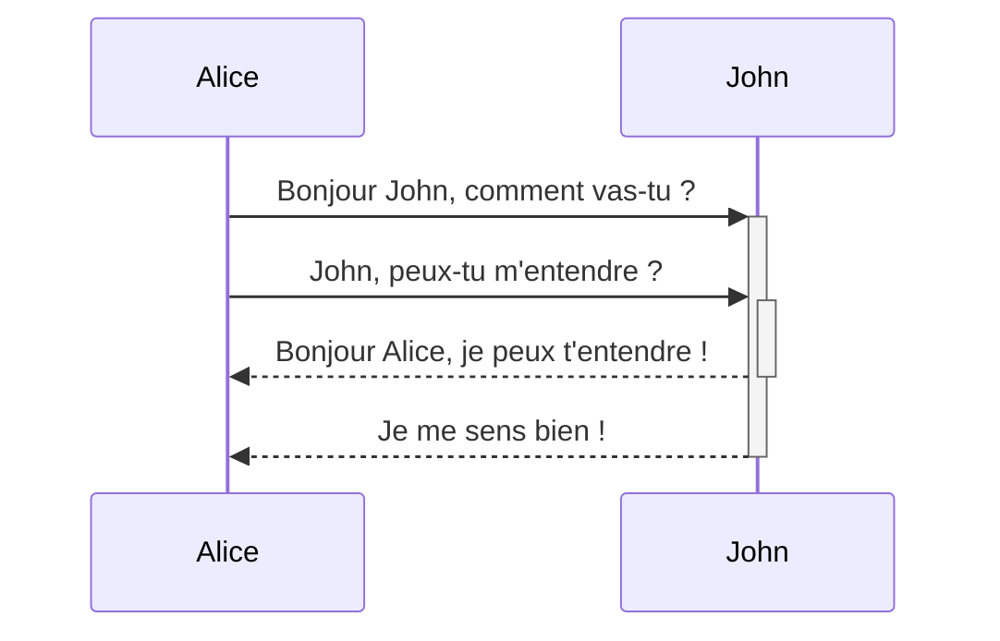
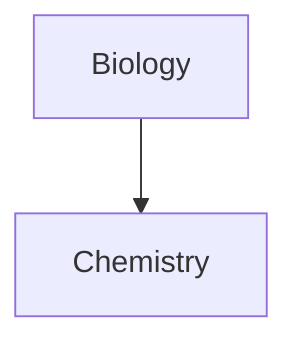

***Diagram***

Obsidian utilise [Mermaid](https://mermaid-js.github.io/) pour afficher des diagrammes et des graphiques. Mermaid fournit également [un éditeur en ligne utile](https://mermaid-js.github.io/mermaid-live-editor).

<pre><code>```mermaid
sequenceDiagram
    Alice->>+John: Bonjour John, comment vas-tu ?
    Alice->>+John: John, peux-tu m'entendre ?
    John-->>-Alice: Bonjour Alice, je peux t'entendre !
    John-->>-Alice: Je me sens bien !
```</code></pre>



Obsidian prend en charge les liens vers les notes dans Mermaid :
<pre><code>```mermaid
graph TD

Biology --> Chemistry

class Biology,Chemistry internal-link;
```</code></pre>



Une façon plus simple de procéder est la suivante : ^376b9d
<pre><code>```mermaid
graph TD

A[Biology]
B[Chemistry]

A --> B

class A,B,C,D,E,F,G,H,I,J,K,L,M,N,O,P,Q,R,S,T,U,V,W,X,Y,Z internal-link;
```</code></pre>


De cette façon, tous les noms de notes (au moins jusqu'à `Z[nom de la note]`) se voient automatiquement attribuer la classe `internal-link` lorsque vous utilisez cet extrait.

Si vous utilisez des caractères spéciaux dans le nom de vos notes, vous devez mettre le nom de la note entre guillemets.
`"⨳ caractère spécial"`
Voici à quoi cela ressemble si vous suivez le [[Mettre en forme vos notes#^376b9d|seconde option]] :
`Un ["⨳ caractère spécial"]`